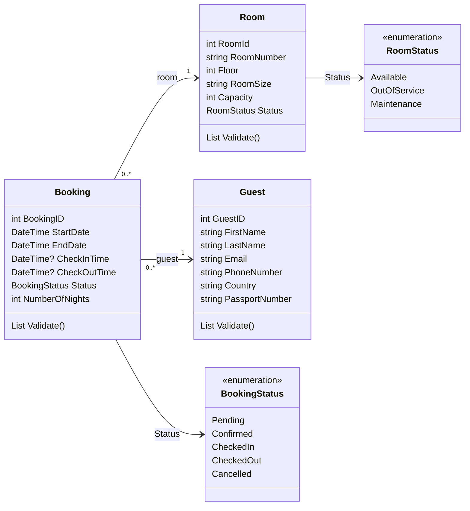

```mermaid
classDiagram
    direction LR

    class Booking {
        int BookingID
        DateTime StartDate
        DateTime EndDate
        DateTime? CheckInTime
        DateTime? CheckOutTime
        BookingStatus Status
        int NumberOfNights
        List<string> Validate()
    }

    class Room {
        int RoomId
        string RoomNumber
        int Floor
        string RoomSize
        int Capacity
        RoomStatus Status
        List<string> Validate()
    }

    class Guest {
        int GuestID
        string FirstName
        string LastName
        string Email
        string PhoneNumber
        string Country
        string PassportNumber
        List<string> Validate()
    }

    class BookingStatus {
        <<enumeration>>
        Pending
        Confirmed
        CheckedIn
        CheckedOut
        Cancelled
    }

    class RoomStatus {
        <<enumeration>>
        Available
        OutOfService
        Maintenance
    }

    Booking "0..*" --> "1" Room : room
    Booking "0..*" --> "1" Guest : guest
    Booking --> BookingStatus : Status
    Room --> RoomStatus : Status
```  
